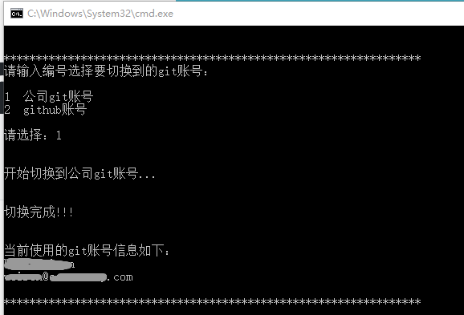

## 1 功能介绍

在工作的时候，在电脑上经常需要切换到公司的git或者外部github的账号信息，然后进行提交操作，每次修改输入一长串命令太麻烦，所以写了个简单的小脚本，方便操作下。

## 2 使用说明

### 2.1 设定账号信息

右键文本方式打开编辑，修改下账号信息：

```bat
::公司的git账号邮箱信息
set COMPANY_USERNAME="XXXX"
set COMPANY_EMAIL="XXXX@XXXXX.com"

::Github的账号邮箱信息
set GITHUB_USERNAME="XXXXX"
set GITHUB_EMAIL="XXXXX@XXXXX.com"
```

### 2.2 （可选）添加环境变量

> 1. 将脚本放在磁盘某个目录里面（比如：`D:\ProgramFiles\self_command`）
> 2. 设置环境变量，将目录添加到Path环境变量里面
> 3. 在CMD命令行窗口中，直接输入`switchgit`命令（其实就是bat脚本文件名，也可以修改文件名为一个自己容易记住的名字）

### 2.3 效果展示




